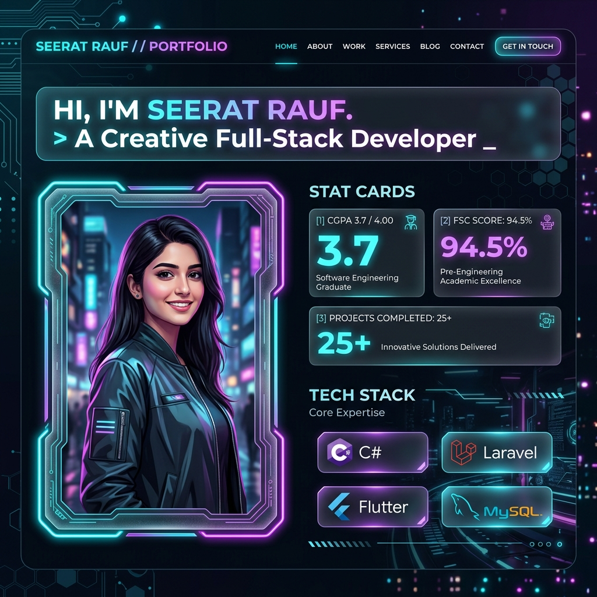
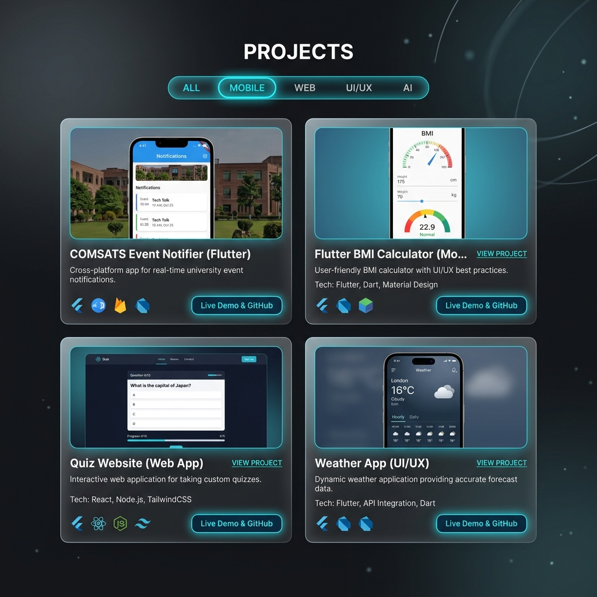

# Seerat Rauf - Interactive Developer Portfolio



> **Software Developer & BS Software Engineering Student**  
> *COMSATS University Islamabad — Vehari Campus (CGPA 3.7)*  
> ✉ [seeratrauf1040@gmail.com](mailto:seeratrauf1040@gmail.com) | ☎ 0313 6992115 | ⌂ City Housing Scheme, Sector A, Burewala

---

## 🌟 Overview

Welcome to the personal developer portfolio website of **Seerat Rauf**. This web application showcases her software development background, projects in **C#**, **Laravel (PHP)**, **Flutter**, and **JavaScript**, work experience at **Fatima Group**, academic record, and technical skill matrix.

It features a high-performance glassmorphic UI, dynamic particle canvas background, real-time interactive project simulators, smooth dark/light theme switching, and silent background email delivery to `seeratrauf1040@gmail.com`.

---

## 📸 Screenshots & Previews

### 1. Hero Section & Profile Card


*Features:*
- Glassmorphic luxury portrait card with ambient glow and precision face framing.
- Dynamic typing title ("Software Developer", "Laravel & C# Backend Specialist", "Flutter Mobile Engineer").
- Real-time stat counter rollups (CGPA 3.7, 94.5% FSc, 5+ Major Projects, 2 Months Internship).
- Quick action CTA buttons ("Explore Projects", "Get in Touch", "Download Resume").

### 2. Featured Projects Showcase


*Features:*
- Filterable gallery tabs (`All`, `Web Applications`, `Laravel / PHP`, `Flutter / Mobile`).
- Live playable app simulator modals (Quiz Game, Flutter BMI Calculator, Event Notifier, Weather Forecast).
- Direct repository links to [seeratrauf on GitHub](https://github.com/seeratrauf).

---

## 🚀 Key Features

- ⚡ **Interactive Canvas Particle Mesh**: Dynamic 2D geometric node network that reacts to cursor movement.
- 🎨 **Theme System**: Seamless dark cyberpunk and light ambient modes with `localStorage` state persistence.
- 💻 **Live IDE Code Viewer**: Switchable code tabs displaying C#, Laravel, and Flutter code snippets with syntax highlighting.
- 🎮 **Playable Project Simulators**:
  - **Interactive Quiz Game**: Test knowledge with real-time feedback.
  - **Flutter BMI Calculator**: Calculate body mass index metrics live.
  - **COMSATS Event Notifier**: Campus alert broadcast simulator.
  - **Event Booking App**: Seat reservation counter and ticket selector.
  - **Weather App**: Forecast and atmospheric conditions card.
- ✉ **Silent AJAX Email Delivery**: Messages submitted on the portfolio are sent directly to `seeratrauf1040@gmail.com` in the background without external redirects or popups.
- 📄 **Curriculum Vitae Modal**: Interactive printable resume modal with quick PDF print support.

---

## 🛠️ Tech Stack & Skills

| Category | Technologies |
| :--- | :--- |
| **Languages** | C#, Java (Basic), PHP, JavaScript (ES6+), Dart |
| **Backend & Web** | Laravel, MySQL, HTML5, CSS3, jQuery, RESTful APIs |
| **Mobile** | Flutter, Cross-Platform Mobile UI/UX |
| **Core Computer Science** | Object-Oriented Programming (OOP), Data Structures & Algorithms |
| **Design & UI** | Glassmorphism, CSS Custom Variables, Responsive Grid & Flexbox |

---

## 💼 Work Experience

### **Software Developer Intern** — *Fatima Group (2 Months)*
- Completed an intensive 2-month internship contributing to corporate software development tasks.
- Applied OOP concepts and web development fundamentals in a professional engineering setting.
- Collaborative problem solving, version control workflows, and code quality code reviews.

---

## 🎓 Education

- **BS in Software Engineering** — *COMSATS University Islamabad (Vehari Campus)*  
  *Feb 2024 – Dec 2027* · **CGPA 3.7**
- **FSc (Pre-Medical)** — *Superior College, Burewala*  
  *Sep 2021 – Apr 2022* · **94.5% Marks**

---

## 💻 How to Run Locally

1. **Clone or navigate to the project directory**:
   ```bash
   cd d:\protfolio
   ```

2. **Run using Node.js static server**:
   ```bash
   node server.js
   ```

3. **Open in Browser**:
   Navigate to `http://localhost:3000` to view the live interactive website.

*(Alternatively, open `index.html` directly in any web browser!)*

---

## 🌐 How to Deploy to Vercel (Fix 404 Error)

If Vercel showed a `404 Not Found` error during deployment, it was because Vercel auto-detected `server.js` as a Node app rather than serving `index.html` directly as a static website.

### Fix Steps:
1. **`vercel.json` included**: A pre-configured `vercel.json` file is now present in the root repository.
2. **Push updates to GitHub**:
   ```bash
   git add .
   git commit -m "Add vercel.json static routing config"
   git push origin main
   ```
3. **Vercel Settings Configuration**:
   - Go to your Vercel Dashboard -> **Project Settings** -> **Build & Development Settings**.
   - Set **Framework Preset** to **Other**.
   - **Build Command**: Leave Empty (or toggle Override off).
   - **Output Directory**: Leave Empty (`./`).
   - Click **Deploy** / **Redeploy**!

Vercel will now serve your portfolio perfectly without any 404 errors!

---

## 🔗 Connect with Seerat Rauf

- ✉ Email: [seeratrauf1040@gmail.com](mailto:seeratrauf1040@gmail.com)
- ☎ Phone: `0313 6992115`
- ⌂ Location: City Housing Scheme, Sector A, Burewala
- 🐙 GitHub: [https://github.com/seeratrauf](https://github.com/seeratrauf)
- 💼 LinkedIn: [https://www.linkedin.com/in/seerat-rauf-37b30b387/](https://www.linkedin.com/in/seerat-rauf-37b30b387/)

